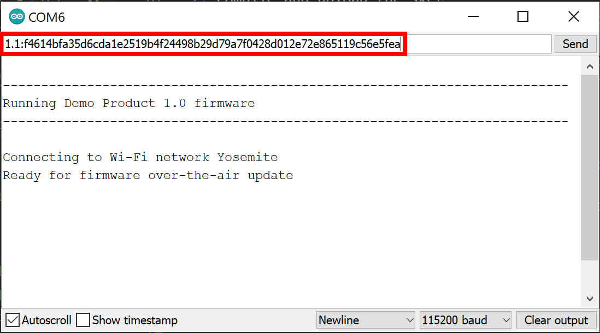

# Simple FOTA update example

The *Simple* example demonstrates the most straight forward manner to make firmware over-the-air updates with FotaHub. It is kind of a "Hello World" example for FOTA updating and a perfect way to get started in that field.

## Operating principle

The device listens for a firmware update info string to be sent over the serial port. It is expected to consist of the new firmware version the device should be updated to followed by a ':' and the checksum of the new firmware version:

`<new-version>:<checksum>` 

e.g., `1.1:a15d5599d8745ff4f51690eb3996afcf75d0b1729d1b8cda2491b03940417521`

Once a valid update info string has been received and the contained new firmware version is different from the version of the firmware already running on the device, the firmware update procedure is triggered. It involves the device to connect to FotaHub and download the binary of the new firmware version. Thereby it uses a dedicated URL including the id of the product representing the device in FotaHub, and the name and the version of the firmware binary to be retrieved.

The downloaded firmware binary is stored in the device's flash memory. At the same time, the downloaded firmware binary's checksum gets recalculated and compared to the checksum included in the previously communicated update info string. If both are matching the firmware update gets activated by restarting the device and letting boot it into the flash memory partition where the downloaded firmware binary has been stored. After the restart, the device executes the new firmware version downloaded from FotaHub.

## Supported targets

The Simple example can be used as is with the [ARDUINO MKR WIFI 1010](https://store.arduino.cc/arduino-mkr-wifi-1010) board. With some adaptations, it can also be used with any other Wifi Nina or Wifi 101 module compatible board of the Arduino MKR family.  

## Installation

If you have not done so already, install the [Arduino IDE](https://www.arduino.cc/en/software) as well as the ArduinoFotaHubClient library and its dependencies as explained [here](../installation/library-installation.md). 

In addition, make sure that you have added the `fotahub.com` root certificate to the Wifi Nina/Wifi 101 Module of your board as explained in [this guide](https://support.arduino.cc/hc/en-us/articles/360016119219-How-to-add-certificates-to-Wifi-Nina-Wifi-101-Modules-).

## Usage

### Create a FotaHub product

Create a FotaHub product for your board as explained [here](../fotahub/create-product.md). It will be used to upload and provide firmware updates for the same. 

### Create and flash initial firmware version onto your board

1. Start the Arduino IDE and open (`File > Open...`) the `Simple` sketch included in the ArduinoFotaHubClient library (`<sketchbook location>/libraries/ArduinoFotaHubClient/examples/Simple/Simple.ino`)

2. Go to the `Configuration.h` file, and initialize the `WIFI_SSID` and `WIFI_PASSPHRASE` constants with the crentials of the Wi-Fi network you want to connect to with your board:

```c
#define WIFI_SSID "My-Fancy-WiFi-SSID"

#define WIFI_PASSPHRASE "My-Cryptic-WiFi-Passphrase"
```

1. Go to the `DemoProductInfo.h` file, and initialize the `DEMO_PRODUCT_ID` and `DEMO_PRODUCT_NAME` constants with the id and the name of the previously created FotaHub product. Leave the `DEMO_PRODUCT_FIRMWARE_VERSION` as is for now. In case you have selected anything else than `SHA256` as the binary checksum algorithm for your FotaHub product, you also must adjust the   `DEMO_PRODUCT_FIRMWARE_UPDATE_VERIFICATION_ALGORITHM` constant accordingly:

```c
#define DEMO_PRODUCT_ID "eb8ab3b1-0938-40ec-afba-9379363948cf"

#define DEMO_PRODUCT_NAME "Demo Product"

#define DEMO_PRODUCT_FIRMWARE_VERSION "1.0"

#define DEMO_PRODUCT_FIRMWARE_UPDATE_VERIFICATION_ALGORITHM FOTA_UPDATE_VERIFICATION_ALGORITHM_SHA256
```
   
> &#x1F6C8; You can look up the id of your [FotaHub](https://fotahub.com) product in the `Settings > General` section of the same.

1. Connect your board to your laptop or computer using a USB cable, and configure the matching board type and serial port in the Arduino IDE (`Tools > Board` and `Tools > Port`).

2. Compile and upload the sketch to your board (&check; and &#x279C; toolbar icons, or `Sketch > Verify/Compile` and `Sketch > Upload`).

3. Open the serial monitor (&#x1F50E; toolbar icon, or `Tools > Serial Monitor`), see how the application starts and verify whether it connects to Wi-Fi network:

 

### Create and upload new firmware version to FotaHub

1. Go back to the `DemoProductInfo.h` file, and bump the `DEMO_PRODUCT_FIRMWARE_VERSION` constant:

```c
#define DEMO_PRODUCT_FIRMWARE_VERSION "1.1"
```

1. Optional: Make another change in your firmware, e.g., increase the blink frequency of the built-in LED on your board by going back to the `Configuration.h` file and decresing the `BLINK_PERIOD` constant:

```c
#define BLINK_PERIOD 250
```

3. Compile the sketch and export the resulting binary to your sketch folder (`Sketch > Export`). Open the sketch folder (`Sketch > Show Sketch Folder`) and locate the binary file named `Simple.ino.<board name>.bin`.

4. Upload the binary to your FotaHub product as explained [here](../fotahub/upload-firmware.md).

### Make your first firmare over-the-air update 

1. Go back to (or reopen) the serial monitor showing the execution status of your board running the initial firmware version. Enter the new firmware version followed by a ':' and the SHA256 checksum of the same in the text field above the area where the output from your board is displayed:

 

> &#x1F6C8; You can find the checksum of the new firmware version by selecting it in the `Details` section of your [FotaHub](https://fotahub.com) product and locating it in the properties of the same.

2. Submit the firmware update info string to your board (`Send` button). This will trigger the firmware over-the-air update procedure. Upon successful completion, the board will be restarted:

 

1. Close and reopen the serial monitor to verify that the board has been restarted and executes the new firmware version as expected. If your new firmware version includes the change wrt to the blink frequency of the built-in LED as mentioned above, you should now see that the latter is blinking significantly faster. 

 