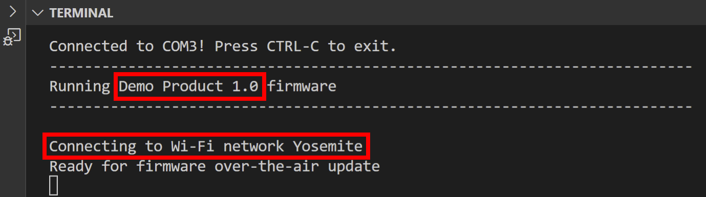
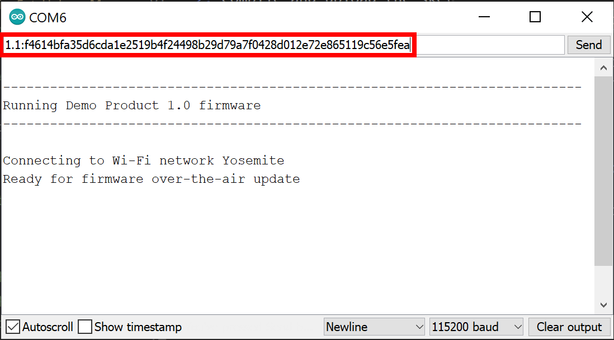
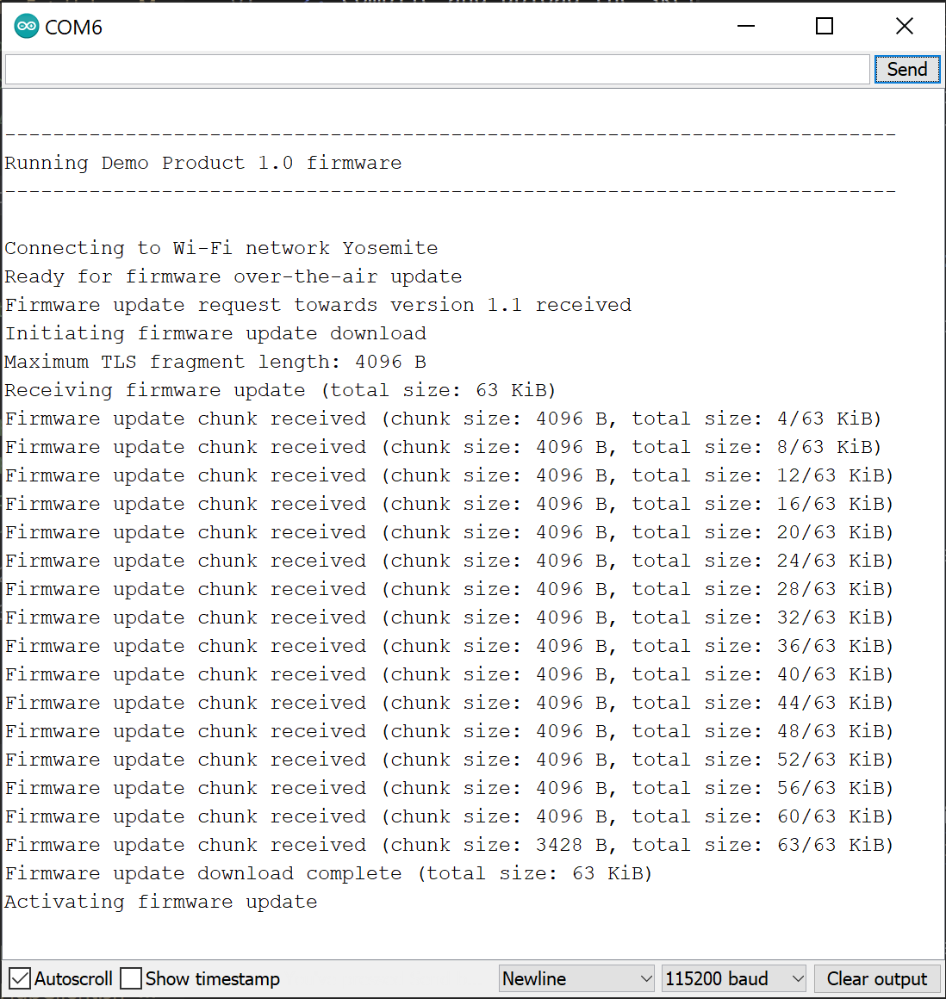

# Simple FOTA update example

The *Simple* example demonstrates the most straight forward manner to make firmware over-the-air updates with FotaHub. It is kind of a "Hello World" example for FOTA updating and a perfect way to get started in that field.

## Operating principle

The device listens for a firmware update info string to be sent over the serial port. It is expected to consist of the new firmware version the device should be updated to followed by a ':' separator and the checksum or signature of the new firmware version:

`<new-version>:<verification-data>` 

For example: 

`1.1:a15d5599d8745ff4f51690eb3996afcf75d0b1729d1b8cda2491b03940417521`

Once a valid update info string has been received and the contained new firmware version is different from the version of the firmware already running on the device, the firmware update procedure is triggered. It involves the device to connect to FotaHub and download the binary of the new firmware version. Thereby, it uses a dedicated URL including the id of the product representing the device in FotaHub, and the name and the version of the firmware binary to be retrieved, e.g.:

`https://bin.fotahub.com/148f689a-deb0-42db-927c-409f73bd9a12/DemoProduct-1.1`

The downloaded firmware binary is stored in the device's flash memory. At the same time, the downloaded firmware binary's checksum or signature is recalculated and compared to the checksum or signature included in the previously communicated update info string. If both match, the firmware update is applied by restarting the device and letting it boot into the flash memory partition where the downloaded firmware binary has been stored. After the restart, the device executes the new firmware version downloaded from FotaHub.

## Supported targets

The Simple example can be used as is with an [Arduino MKR WiFi 1010](https://store.arduino.cc/arduino-mkr-wifi-1010) or an [Arduino Uno WiFi Rev2](https://store.arduino.cc/collections/boards/products/arduino-uno-wifi-rev2) board. It is also possible to use an [Arduino Uno Rev3](https://store.arduino.cc/collections/boards/products/arduino-uno-rev3) or an [Arduino Mega 2560 Rev3](https://store.arduino.cc/collections/boards/products/arduino-mega-2560-rev3) board with a Wifi Nina compatible shield.

## Installation

A description of the SDKs and tools that must be available on your laptop or computer and advise how to install them can be found [here](../../../README.md#installation).

## Usage

### Create a FotaHub product

Create a FotaHub product that represents your board in FotaHub as explained [here](../fotahub/create-product.md). It will be used to upload and provide firmware updates for the same. 

### Get the ArduinoFotaHubClient library

If not yet done so, either clone or download and uncompress the [ArduinoFotaHubClient](https://github.com/fotahub/ArduinoFotaHubClient) library to a location of your choice on your machine. 

> &#x26A0; Make sure that the path to the location of the ArduinoFotaHubClient library on your machine does not contain any spaces.

### Create and flash initial firmware version onto your board

1. Start Visual Studio Code and open (`File` > `Folder...`) the `Simple-<board-name>` sketch matching your board from the `examples` folder of the ArduinoFotaHubClient library project.

2. Go to the `Configuration.h` file, and initialize the `WIFI_SSID` and `WIFI_PASSPHRASE` constants with the credentials of the Wi-Fi network you want to connect to with your board:

    ```c
    #define WIFI_SSID "my-fancy-WiFi-SSID"

    #define WIFI_PASSPHRASE "my-cryptic-WiFi-passphrase"
    ```

3. Open the `DemoProductInfo.h` file, and initialize the `DEMO_PRODUCT_ID` and `DEMO_PRODUCT_NAME` constants with the id and the name of the previously created FotaHub product (see `Products` > `{{Your FotaHub product}}` > `Settings` > `General` at [Fotahub](https://fotahub.com)). Leave the `DEMO_PRODUCT_FIRMWARE_VERSION` as is for now. In case you have selected anything else than `SHA256` as the binary checksum algorithm for your FotaHub product or opted for using a signature instead, you also must adjust the `DEMO_PRODUCT_FIRMWARE_UPDATE_VERIFICATION_ALGORITHM` constant accordingly:

    ```c
    #define DEMO_PRODUCT_ID "148f689a-deb0-42db-927c-409f73bd9a12"

    #define DEMO_PRODUCT_NAME "Demo Product"

    #define DEMO_PRODUCT_FIRMWARE_VERSION "1.0"

    #define DEMO_PRODUCT_FIRMWARE_UPDATE_VERIFICATION_ALGORITHM FOTA_UPDATE_VERIFICATION_ALGORITHM_SHA256
    ```

4. Open the integrated terminal (`Terminal` > `New Terminal`) and build the sketch by typing the following command:
   
    ```sh
    make
    ```

5. Connect your board to your laptop or computer using a USB cable, and upload the sketch to your board using the following command:

    ```sh
    make upload
    ```

6. Run the serial monitor by entering the command mentioned below. Observe how the board starts up and verify whether it connects to the Wi-Fi network. Stop the serial monitor using `Ctrl+C` when done. 

    ```sh
    make monitor
    ```

     

    Also have a look at the built-in LED on your board. It should blink with a period of approx. 1 s. 

### Create and upload a new firmware version to FotaHub

1. Go back to the `DemoProductInfo.h` file, and bump the `DEMO_PRODUCT_FIRMWARE_VERSION` constant:

    ```c
    #define DEMO_PRODUCT_FIRMWARE_VERSION "1.1"
    ```

2. *Optional:* Make another change in your firmware, e.g., increase the blink frequency of the built-in LED on your board by going back to the `Configuration.h` file and decreasing the `BLINK_PERIOD` constant:

    ```c
    #define BLINK_PERIOD 250
    ```

3. Recompile the sketch using `make` in very much the same way as you did for building the initial firmware version (see step 4 in the previous section). Locate the resulting new firmware binary file named `Simple-<board-name>.ino.bin` in the `build` folder (using the `Explorer` view).
   
4. Upload the binary as firmware version `1.1` to your FotaHub product as explained [here](../fotahub/upload-firmware.md).

### Make your first firmare over-the-air update 

1. Reset your board using the reset button (`RST` or `RESET`).

2. Rerun the serial monitor using `make monitor` as before (see step 6 in the penultimate section). Wait until the board has started up and displays a log message saying that it is ready to receive firmware-over-the-air updates. Enter the new firmware version followed by a ':' separator and the checksum or signature of the same (see `Products` > `{{Your FotaHub product}}` > `Details` > `{{New firmware version}}` at [Fotahub](https://fotahub.com)) after the last log message in the serial monitor output:

     

3. Submit the firmware update info string to your board by hitting the `ENTER` key. This will trigger the firmware over-the-air update procedure. Upon successful completion, the board will be restarted with the new firmware version downloaded from FotaHub. To verify that, check the firmware version in the banner showing up in the serial monitor output:

     

    In case that the new firmware version includes the change wrt to the blink frequency of the built-in LED on your board as mentioned above, you should also see that the latter is blinking significantly faster now.