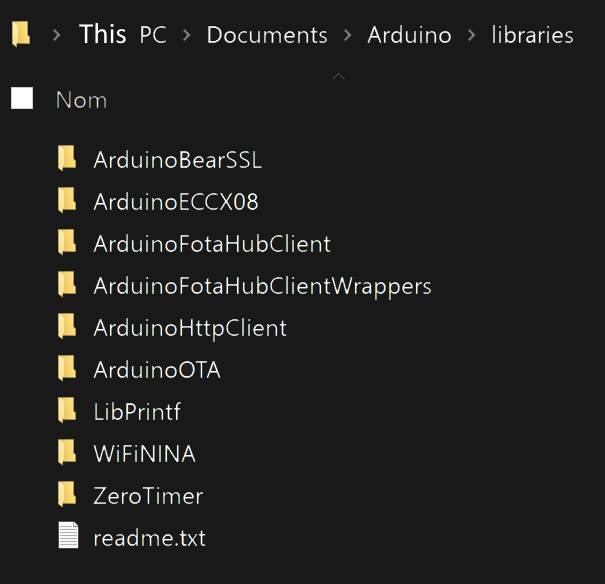

# How to install the ArduinoFotaHubClient library

You can install the ArduinoFotaHubClient library [manually](#manual-installation-using-arduino-ide) using the [Arduino IDE](https://www.arduino.cc/en/software) or in a [semi-automated](#semi-automated-installation-using-arduino-cli) way using the [Arduino CLI](https://github.com/arduino/arduino-cli).

## Manual installation using Arduino IDE

> &#x26A0; First make sure that all instances of the Arduino IDE are closed. The IDE only scans for libraries at startup. It will not see any manually installed library as long as any instance of the IDE is open!
   
1. Manually install the libraries listed below from GitHub using one of the following methods:
   1. Download the libraries as ZIP, and extract all content into the `libraries` folder under your Arduino **sketchbook location** (see &#x1F6C8; below for details). Rename the extracted root folders so that each of them has the same name as the contained library. 
   2. [Clone](https://github.com/git-guides/git-clone) the libraries right into the `libraries` folder under your Arduino **sketchbook location** (see &#x1F6C8; below for details).
       
    * [ArduinoFotaHubClient](https://github.com/fotahub/ArduinoFotaHubClient)
    * [ArduinoFotaHubClientWrappers](https://github.com/fotahub/ArduinoFotaHubClientWrappers)
    * [ZeroTimer](https://github.com/EHbtj/ZeroTimer)

> &#x1F6C8; The **sketchbook location** is the folder where the Arduino IDE stores your sketches. You can look up its location in the Arduino IDE preferences (`File -> Preferences`). The default location under Linux is `/home/Sketchbook`, and on Windows or Mac OS X it is a folder named `Arduino` inside your `Documents` folder.

> &#x1F6C8; The **ZeroTimer** library is different from the **Adafruit ZeroTimer Library** that can be installed using the Arduino Library Manager.

 2. Start the Arduino IDE and open the Arduino Library Manager (`Sketch > Include Library > Manage Libraries...`). Find and install the following libraries:
    * ArduinoBearSSL
    * ArduinoECCX08
    * ArduinoHttpClient
    * ArduinoOTA
    * LibPrintf
    * WiFiNINA
  
3. When done, double-check that the ArduinoFotaHubClient library and all its dependencies are present in your sketchbook location's `libraries` folder:

 

## Semi-automated installation using Arduino CLI

1. Download and install the [Arduino CLI](https://github.com/arduino/arduino-cli/releases) **0.14.0** or later.

2. Download the ArduinoFotaHubClient library installer script for [Windows](https://raw.githubusercontent.com/fotahub/ArduinoFotaHubClient/main/extras/install-ArduinoFotaHubClient.bat) or [Linux/Mac OS X](https://raw.githubusercontent.com/fotahub/ArduinoFotaHubClient/main/extras/install-ArduinoFotaHubClient.sh) and copy or move it into your Arduino **sketchbook location**.

> &#x1F6C8; The **sketchbook location** is the folder where the Arduino IDE stores your sketches. You can look up its location in the Arduino IDE preferences (`File -> Preferences`). The default location under Linux is `/home/Sketchbook`, and on Windows or Mac OS X it is a folder named `Arduino` inside your `Documents` folder.

3. Open a terminal window and change directory into your Arduino sketchbook location.

4. Define an environment variable named `ARDUINO_CLI_HOME` and that points to the Arduino CLI's install location.

5. Run the ArduinoFotaHubClient library installer script. When is has completed, double-check that the ArduinoFotaHubClient library and all its dependencies are present in your sketchbook location's `libraries` folder:

 